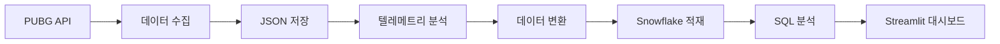

# 🎮 PUBG Top 10 생존자 분석 프로젝트

배틀그라운드 API를 활용한 데이터 수집, 분석, 시각화 파이프라인 프로젝트

## 📁 프로젝트 구조

```
pubg-data-pipeline/
│
├── config/
│   ├── config.json              # 설정 파일
│   └── secrets.toml             # Streamlit secrets (Snowflake 연결 정보)
│
├── src/
│   ├── collectors/
│   │   └── pubg_collector.py    # PUBG API 데이터 수집
│   ├── analyzers/
│   │   └── telemetry_analyzer.py # 텔레메트리 데이터 분석
│   ├── loaders/
│   │   └── snowflake_loader.py  # Snowflake 데이터 로더
│   └── pipeline/
│       └── data_pipeline.py     # 통합 파이프라인
│
├── sql/
│   ├── create_tables.sql        # 테이블 생성 DDL
│   ├── analysis_views.sql       # 분석용 뷰 생성
│   └── dashboard_queries.sql    # 대시보드 쿼리
│
├── dashboard/
│   └── streamlit_app.py         # Streamlit 대시보드
│
├── data/
│   ├── raw/                     # 원본 JSON 데이터
│   └── processed/               # 처리된 CSV 데이터
│
├── logs/                        # 로그 파일
│
├── requirements.txt             # Python 패키지 목록
├── README.md                    # 프로젝트 설명
└── .gitignore                   # Git 제외 파일
```

## 🚀 시작하기

### 1. 사전 준비

#### 1.1 PUBG Developer API 키 발급
1. https://developer.pubg.com/ 접속
2. 회원가입 및 로그인
3. API 키 발급 (Rate Limit: 10 requests/min)

#### 1.2 Snowflake 계정 준비
1. Snowflake 계정 생성 (무료 트라이얼 가능)
2. 데이터베이스 및 스키마 생성:
```sql
CREATE DATABASE PUBG_DATA;
CREATE SCHEMA PUBG_DATA.RAW;
USE SCHEMA PUBG_DATA.RAW;
```

### 2. 환경 설정

#### 2.1 Python 가상환경 생성 및 패키지 설치
```bash
# 가상환경 생성
python -m venv venv

# 가상환경 활성화
# Windows
venv\Scripts\activate
# Mac/Linux
source venv/bin/activate

# 패키지 설치
pip install -r requirements.txt
```

#### 2.2 requirements.txt
```txt
# API & 데이터 수집
requests==2.31.0
pandas==2.1.3
numpy==1.26.2

# Snowflake
snowflake-connector-python==3.6.0
snowflake-sqlalchemy==1.5.1

# 데이터 분석
scipy==1.11.4
scikit-learn==1.3.2

# 대시보드
streamlit==1.29.0
plotly==5.18.0
matplotlib==3.8.2
seaborn==0.13.0

# 스케줄링
schedule==1.2.0

# 유틸리티
python-dotenv==1.0.0
pyyaml==6.0.1
```

#### 2.3 config.json 설정
```json
{
  "pubg_api": {
    "api_key": "YOUR_PUBG_API_KEY",
    "platform": "steam",
    "seed_players": [
      "HighRankPlayer1",
      "HighRankPlayer2",
      "HighRankPlayer3"
    ]
  },
  "snowflake": {
    "account": "your_account.region",
    "user": "your_username",
    "password": "your_password",
    "warehouse": "COMPUTE_WH",
    "database": "PUBG_DATA",
    "schema": "RAW"
  },
  "pipeline": {
    "num_matches": 30,
    "schedule_interval_hours": 6,
    "data_retention_days": 30
  },
  "paths": {
    "raw_data": "./data/raw",
    "processed_data": "./data/processed",
    "logs": "./logs"
  }
}
```

#### 2.4 Streamlit secrets 설정
`.streamlit/secrets.toml` 파일 생성:
```toml
[snowflake]
account = "your_account.region"
user = "your_username"
password = "your_password"
warehouse = "COMPUTE_WH"
database = "PUBG_DATA"
schema = "RAW"
```

### 3. 데이터베이스 설정

Snowflake에서 테이블 생성:
```bash
# SQL 스크립트 실행
snowsql -a your_account -u your_username -d PUBG_DATA -s RAW -f sql/create_tables.sql
```

또는 Snowflake Web UI에서 직접 실행

### 4. 실행

#### 4.1 초기 데이터 수집
```bash
python src/pipeline/data_pipeline.py
```

#### 4.2 스케줄링된 자동 실행
```python
# data_pipeline.py 에서 마지막 부분 수정
if __name__ == "__main__":
    pipeline = PUBGDataPipeline('config.json')
    pipeline.create_directories()
    
    # 스케줄링 실행 (6시간마다)
    pipeline.schedule_pipeline()
```

#### 4.3 대시보드 실행
```bash
streamlit run dashboard/streamlit_app.py
```

브라우저에서 자동으로 `http://localhost:8501` 열림

## 📊 대시보드 기능

### 대시보드 1: 무빙 & 교전 패턴 분석
- **랭크별 무빙 패턴**: 이동거리, 속도, 분포 분석
- **교전 패턴 분석**: 공격 횟수, 킬 수, 교전 거리
- **무빙-교전 상관관계**: 이동거리 vs 킬 효율
- **Top 플레이어 상세**: 개별 플레이어 성능 지표

### 대시보드 2: 무기 조합 & 교전 거리
- **승자의 무기 선호도**: Top 3 생존자가 선호하는 무기
- **최적 무기 조합**: 2개 무기 조합별 승률
- **무기별 교전 거리**: 무기별 최적 교전 거리 분석
- **게임 단계별 무기 선택**: 초반/중반/후반 무기 트렌드
- **무기 전환 패턴**: 무기 카테고리 전환 흐름

## 🔍 주요 분석 지표

### 무빙 패턴
- 총 이동거리 (m)
- 평균 이동속도 (m/s)
- 이동 지속시간
- km당 킬 효율

### 교전 패턴
- 총 공격 횟수
- 총 킬 수
- KD 비율
- 평균 교전 거리
- 공격 효율성 (킬/공격)

### 무기 분석
- 무기 사용 빈도
- 무기별 평균 킬
- 무기 조합 승률
- 거리대별 킬 분포

## 📈 데이터 흐름



## 🛠 트러블슈팅

### 문제 1: API Rate Limit 초과
```python
# pubg_collector.py에서 sleep 시간 조정
time.sleep(0.6)  # 더 길게 설정 (예: 1초)
```

### 문제 2: Snowflake 연결 실패
- 방화벽 설정 확인
- Snowflake 계정 정보 재확인
- 네트워크 정책 확인

### 문제 3: 텔레메트리 데이터 크기 문제
```python
# 메모리 부족 시 배치 크기 줄이기
match_ids = match_ids[:10]  # 한번에 처리할 매치 수 제한
```

## 📝 고랭크 플레이어 찾기 팁

### 방법 1: PUBG Leaderboard
1. https://pubg.op.gg/leaderboards 방문
2. 상위 랭커 닉네임 수집
3. `config.json`의 `seed_players`에 추가

### 방법 2: 프로 선수 추적
- 프로 대회 참가자 명단 활용
- 트위치/유튜브 스트리머 닉네임 수집

### 방법 3: API를 통한 자동 수집
```python
# 리더보드 API (있는 경우)
def get_top_players(season_id, mode='squad-fpp'):
    url = f"{base_url}/leaderboards/{season_id}/{mode}"
    # ...
```

## 🔐 보안 주의사항

1. **API 키 보호**
   - `.gitignore`에 config.json 추가
   - 환경변수 사용 권장
   ```python
   import os
   API_KEY = os.getenv('PUBG_API_KEY')
   ```

2. **Snowflake 자격증명**
   - secrets.toml은 절대 Git에 커밋하지 않음
   - 프로덕션에서는 환경변수나 Secret Manager 사용

## 📊 성능 최적화

### 1. 데이터 수집 최적화
- 병렬 처리 활용 (ThreadPoolExecutor)
- 캐싱 전략 구현
- 증분 로드 (새 데이터만)

### 2. Snowflake 쿼리 최적화
```sql
-- 클러스터링 키 설정
ALTER TABLE TOP10_SURVIVORS CLUSTER BY (match_id, rank);

-- 머티리얼라이즈드 뷰 생성
CREATE MATERIALIZED VIEW MV_DAILY_STATS AS
SELECT ...
```

### 3. 대시보드 성능
- 쿼리 결과 캐싱 (@st.cache_data)
- 페이지네이션 구현
- 데이터 집계 사전 계산

## 📚 추가 기능 아이디어

1. **실시간 알림**
   - 특정 플레이어의 새 매치 알림
   - 이상 패턴 감지 및 알림

2. **머신러닝 모델**
   - 승리 예측 모델
   - 플레이어 스타일 클러스터링

3. **비교 분석**
   - 플레이어 간 비교
   - 시즌별 트렌드 분석

4. **맵별 분석**
   - 맵별 전략 차이
   - 핫스팟 히트맵

## 🤝 기여하기

이슈나 개선 아이디어가 있다면 언제든지 제안해주세요!

## 📄 라이선스

MIT License

## 📧 문의

프로젝트 관련 문의사항이 있으시면 이슈를 열어주세요.

---

**Happy Gaming! 🎮**
